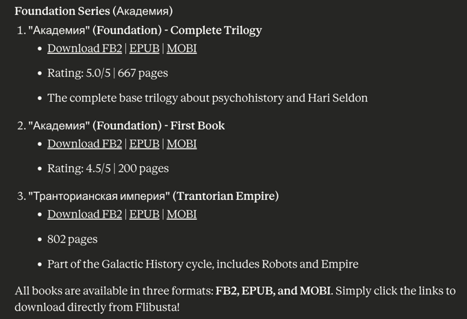

# lit-mcp

**DISCLAIMER: This project is not affiliated with or endorsed by any book websites. 
Use it responsibly and respect copyright laws.**

**lit-mcp** allows LLMs to work with popular books websites (currently only **Flibusta**). Initially I started this project to
learn some basic SpringAI and MCP concepts, but it turned out to be quite useful.

I started with **Flibusta** because it is one of the largest free book repositories. I haven't found any public APIs for it, 
however it turned out that it is pretty easy to scrape the data I needed from the website by using CSS Selectors. 
It also doesn't require any authentication to access its contents.

Also, I chose SpringAI and Kotlin due to these technologies being new to me, so this project served as well as a learning experience.

I was trying to use AI to generate some parts of the code especially for the parts that involve web scraping and parsing HTML.
As I see it as of now, AI is quite helpful in generating boilerplate code and providing suggestions, 
but it still requires human supervision to ensure correctness and quality. 

Although my initial goal was to check if I would be able to vibe code the whole project using AI, it turned out that
this is not yet feasible for non-trivial projects and lots of human input is still required.

## Features and limitations

`lit-mcp` supports both `stdio` and `HTTP` modes. `stdio` mode is useful to run the MCP server locally and connect 
it to clients that support `stdio` MCPs (such as Codex, Claude Desktop, or local LLMs running under LM Studio).

Only books in Russian language are supported at the moment, since **Flibusta** mostly contains russian books.

Project currently supports the following set of tools:

- `flibustaGetGenresList`: Get all available genres list
- `flibustaSearchBooksByName`: Search books by name and returns their names and IDs
- `flibustaGetBookInfoByIds`: Get book info by book ID. Returns detailed info for each book ID such as title, authors, genres, description, download links, user rating, user reviews, etc.
- `flibustaGetPopularBooksList`: Get top rated books list
- `flibustaGetRecommendedBooks`: Get recommended books paginated (50 items per page)
- `flibustaRecommendedAuthors`: Get recommended authors paginated (50 items per page)

For more information, please check the source code and the tool definitions.

## Usage

Please make sure you have Java 21 or newer installed on your system. Kotlin and Gradle are not required to run the
prebuilt application.

Download `lit-mcp.jar` from the [latest GitHub release](https://github.com/risboo6909/lit-mcp/releases/latest), or use:

```bash
curl -L https://github.com/risboo6909/lit-mcp/releases/latest/download/lit-mcp.jar -o lit-mcp.jar
```

Run the downloaded JAR in `stdio` mode with:

```bash
java -jar lit-mcp.jar --transport=stdio
```

### Building from source

To build the project, you can use the following command:

```bash
make build
```

This will compile the source code and create a runnable JAR file in the `build/libs` directory.

To run the MCP server in `stdio` mode, you can use the following command:

```bash
make run_stdio
```

To run the MCP server in `HTTP` mode, you can use the following command:

```bash
make run_http
```

On Windows systems, please use `gradlew.bat` to build and run the project.

### Codex

To connect `lit-mcp` to Codex, add the following to `~/.codex/config.toml`:

```toml
[mcp_servers.lit]
command = "java"
args = ["-jar", "/absolute/path/to/lit-mcp.jar", "--transport=stdio"]
```

Replace `/absolute/path/to/lit-mcp.jar` with the location of the downloaded JAR, then restart Codex.

### Claude Desktop

One of possible ways to try it out is to use Claude Desktop app. You can configure it to use `lit-mcp` in `stdio` mode by following these steps:

1. Download and install Claude Desktop from https://www.claude.com/download
2. Open Claude Desktop and go to Settings.
3. Goto Developer tab.
4. Click `Edit Config` button and open `claude_desktop_config.json` file in a text editor.
5. Add the following block to the `mcpServers` section:
```json
{
  "mcpServers": {
    "lit-mcp": {
      "command": "java",
      "args": [
        "-jar",
        "/absolute/path/to/lit-mcp.jar",
        "--transport=stdio"
      ]
    }
  }
}
```
6. Save the file and restart Claude Desktop.
7. Enjoy! Try to ask Claude to search for a book or get book info, e.g. "Find me books by Isaac Asimov and provide links to download them from Flibusta".

Example output from Claude when using `lit-mcp`:


## Contributing

Contributions are welcome! If you find any issues or have suggestions for improvements, please feel free to open an issue 
or submit a pull request.

## Future plans

- Make this server available via public HTTP endpoint so that it can be used without running locally
- Add support for more book websites (including English language ones)
- Improve existing tools and add more tools
- Add more examples and documentation
- etc.
